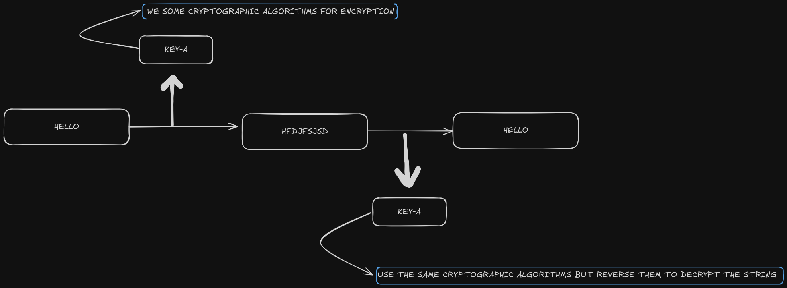
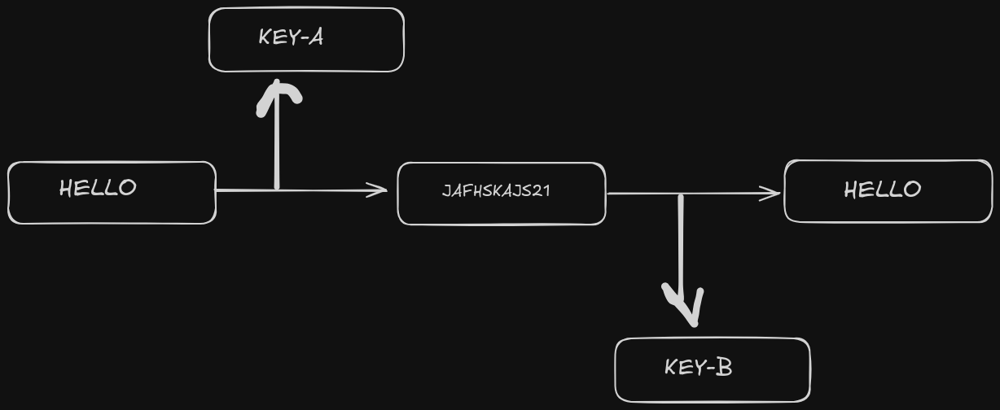

# SOLANA

## What is solana 
just another blockchain like etherium, bitcoin or other

## Main question should be why solana:

1. **Faster transaction in compaire to other blockchain fairly take 2 or more sec**
2. **Less transection fee(gas)**
3. **High nakamoto coefficient(decentralized score)**

 

# Cryptography and the Solana Network

### Before starting, let's get familiar with some terms:

1. **Keypairs: A combination of a public key and a secret key.**
2. **Public Key: In Solana, it's just an address used to map an account.**
3. **Secret Key/Private Key: Used to verify authority over the account. [If you don't have the secret key, then it's not your account.]**

## Cryptography(Study of hiding information):
=> There are two typr of cryptography:
    
    1. Symmetric cryptography
    2. Asymmetric Cryptography

## Symmetric Cryptography:
- Here we just use single/same key to encrypt and decrypt data.

- The most common symmetric cryptography encryptions are AES and ChaCha20 (a refined version of Salsa20) [RFC-7539].

## Asymmetric Cryptography:
- Here we use two different keys for encryption and decryption:
  
  1. Public Key
  2. Private/Secret Key

- This provides us with two key features:
  
  1. Encryption
  2. Signature/Authentication

> Let's see how:  
  1. **Encryption**: If it's encrypted with a public key, only the secret key from the same keypair can be used to read it.  
  2. **Signature/Authentication**: If it's encrypted with a secret key, the public key from the same keypair can be used to prove the secret key holder signed it.

- There are various asymmetric cryptography algorithms, but the most common you'll see today are variants of ECC or RSA.

- Before ending this, let's take a look at "KEY EXCHANGE," where we use a combination of "Symmetric Cryptography" and "Asymmetric Cryptography." Let's see how this works.

> [NOTE: There is a thing called a public key server where people can upload their public key so that anyone in the world can see what their public key is.]

Let's take an example: Bob and Alice are talking over an insecure channel (it can be anything, like the web or IRC). They can use cryptography to securely communicate over the insecure channel. What they can do is share their public keys with each other so they can decrypt the messages that were encrypted. As we saw a few minutes ago, if I encrypt something with my private key, it can only be decrypted by my public key. So, if Alice encrypts something with her private key, it can only be decrypted by her public key. This process provides authenticity of the message and even helps them communicate securely over an insecure channel, but it does make things a little slow.
As we know, asymmetric cryptography is slower than symmetric cryptography. So, what we can do is create a key called a 'session key,' which is a combination of Alice's private key and Bob's public key, and encrypt the message with that key. By doing this, we are applying our symmetric cryptography knowledge over asymmetric cryptography. Now we have just one key, which helps enhance the speed of securely communicating over an insecure network.

## Solana uses public keys as addresses
- Solana uses the ED25519 curve algorithm primarily for digital signatures. A digital signature is a mathematical scheme that allows someone to verify the authenticity of a message or transaction. When a user (like a wallet holder) signs a transaction in Solana, they use their private key with the ED25519 algorithm to create a unique signature.

- This signature can then be verified by anyone using the corresponding public key(solana address).

## Why ED25519?

1. **Security**: ED25519 provides strong security properties, making it resistant to various cryptographic attacks.

2. **Efficiency**: It is also highly efficient, enabling fast verification and signing, which is crucial for a high-performance blockchain like Solana.

...